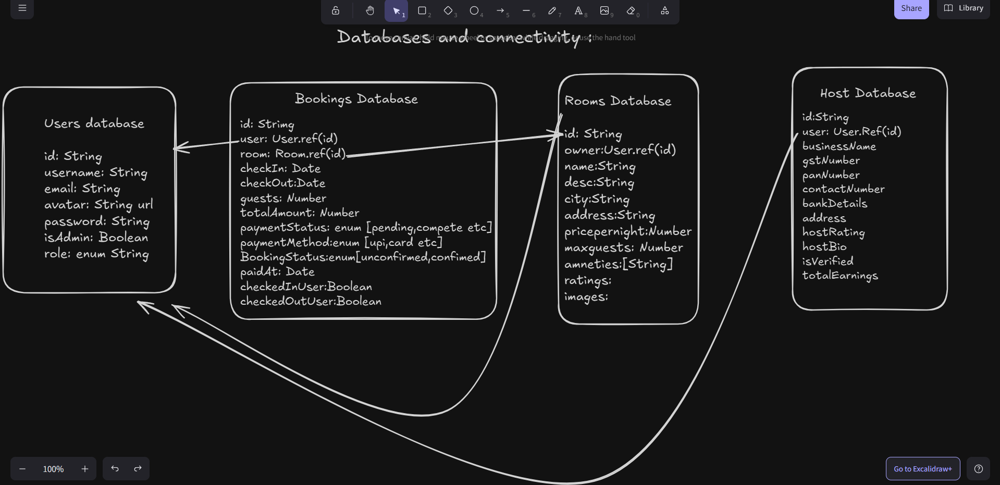

/*
==============================
🔐 JWT Access + Refresh Token Flow
==============================

1. ✅ When user logs in:
   - Access token and refresh token are created.
   - Both are stored in cookies.
   - Refresh token is also stored in database.

2. 🕒 Access token has a short life (e.g. 15 min).
   - It's used to access protected routes like /rooms.
   - If it's valid, request works fine.

3. ⛔ If access token expires:
   - Backend middleware sends 401 Unauthorized.
   - Frontend catches this and calls /api/auth/refresh-token.

4. 🔁 Refresh Access Token Endpoint:
   - Checks refresh token in cookies.
   - Verifies it and matches with one in DB.
   - If valid → creates new access + refresh tokens.
   - Sets them again in cookies (new session begins).

5. 🔄 The failed API call is retried with the new access token.

6. 💪 This keeps the user logged in *without* making them log in again manually.

🎯 Purpose:
- Access token = short-lived, secure for requests.
- Refresh token = longer-lived, stored securely, used to renew access tokens.

🔥 Bonus:
- All this is automatic. Frontend doesn't have to check expiry manually.
- Only failed requests due to token expiry will trigger refresh.

*/

///////////////////////////////////////////Model Schema ///////////////////////////////////////////////////////////////////////
///////////////////////////////  .PRE    //////////////////////////////////////////////////////
//.pre is a mongoose method that runs before saving the document..it taskes two arguments, the first is the event that triggers the middleware (in this case 'save') and the second is a callback function that contains the logic to be executed before saving the document..this refers to the user document being saved..async is used to make the function asynchronous so that we can use await inside it..bcrypt.hash() is a method that hashes the password using bcrypt library..10 is the salt rounds used for hashing the password, it determines how many times the password will be hashed, higher number means more security but also more time taken to hash the password

////////////////////////////////   isModified   ////////////////////////////////////////////////
//isModeified is a mongoose method that checks if the field is modified or not

/////////////////////////////////////// next() ////////////////////////////////////////////////
//next() is a callback function that tells mongoose to continue with the next middleware or save the document

/////////////////////////////////////  isPasswordMatched,bcrypt and this keyword ///////////////////////////////////////
//this is a method that checks if the password entered by the user matches the hashed password stored in the database..it uses bcrypt.compare() method to compare the passwords..isPasswordMatched is a custom method that can be called on the user document to check if the password matches or not..this.password is the hashed password stored in the database and password is the password entered by the user during login..bcrypt.compare() returns a promise that resolves to true if the passwords match and false if they do not match..

//////////////////////////////////////  userSchema.methods //////////////////////////////////////////////////////////////////
// userSchema.methods is used to define custom methods on the user schema that can be called on the user document instance...

////////////////////////////////////// jsonwebtokens ////////////////////////////////////////////////////////////////
//A JWT (JSON Web Token) is a compact, URL-safe token used to securely transmit information between parties as a JSON object. It's commonly used for authentication and authorization in web applications.

// A JWT token has three parts separated by dots (.):
// xxxxx.yyyyy.zzzzz
//  ^      ^     ^
//  |      |     |
//  |      |     └── Signature (with secret key)
//  |      └──────── Payload (user data/claims)
//  └────────────── Header (metadata)
// 🔐 1. Header
// The header contains metadata about the token, such as the type of token and the signing algorithm used.

// Example (before encoding):

// {
    //   "alg": "HS256",
    //   "typ": "JWT"
    // }
    // alg: Algorithm used to sign the token, e.g., HS256 (HMAC SHA-256)
    
    // typ: Type of token, always "JWT"
    
    // It is then Base64Url encoded.
    
    // 📦 2. Payload
// The payload contains the claims — the actual data you want to transmit, such as user ID, email, roles, etc.

// Example:

// {
    //   "sub": "1234567890",
    //   "name": "John Doe",
    //   "role": "admin",
    //   "iat": 1717200000,
    //   "exp": 1717203600
// }
// sub: Subject (usually user ID)

// name: User’s name

// role: Role of the user

// iat: Issued At (Unix timestamp)

// exp: Expiry time (used to expire the token)

// This is also Base64Url encoded, but not encrypted, so avoid putting sensitive data here.

// 🔏 3. Signature
// This is the most important part. It verifies that the token wasn't tampered with. It is generated by hashing the header and payload with a secret key and the algorithm specified in the header.

//Example:

// HMACSHA256(
    //   base64UrlEncode(header) + "." + base64UrlEncode(payload),
    //   secret
    // )
    // The secret is a private key (known only to the server).
    
    // If someone modifies the header or payload, the signature will no longer match.
    
    
    
    ///////////////////////////////////// creating a jwt token //////////////////////////////////////////////////////
    // 1. Create ..
    // jwt.sign({id:23,email:"s@gmail",name:"Shivam"},secretKey,{expiresIn:"1d"})})
    //2.Verify
    //jwt.verify(token,secretKey,(err,decoded)=>{
        //     if(err){
            //         console.log("Invalid token");
            //     }else{
                //         console.log(decoded);
                //     }

 ////////////////////////////////////////////////////// exporting the User model //////////////////////////////////////////////////////           
//export const User=mongoose.model('User',userSchema); this exports the User model which can be used to interact with the users collection in the database..it uses mongoose.model() method to create a model from the userSchema defined above..the first argument is the name of the model (User) and the second argument is the schema (userSchema)..this allows us to perform CRUD operations on the users collection in the database using this model....in mongoose the name will be saved as plural and lowercase, so the collection name will be 'users' in the database.

///////////////Flow in express/////////////

Client (Frontend / Postman)
     ⬇
   Route (in routes folder)
     ⬇
Middleware (optional)
     ⬇
Controller Function (in controllers folder)
     ⬇
  Response sent using res.json(), res.send(), etc.

  ✅ 1. routes/ folder
Purpose: Define all the endpoints (/api/...)

What goes here: router.get('/rooms', checkAccessToken, getRooms)

It just connects a URL to controller & middleware

✅ 2. middlewares/ folder
Purpose: Handle logic before the final controller runs.

Common use cases:

Check JWT access token

Validate user inputs

Catch errors

Call next() to move to the next function in the chain.

✅ 3. controllers/ folder
Purpose: Actual business logic.

What goes here:

DB queries

Sending back responses

Uses req to get data, and res to send response.

✅ Why use POST for logout?
Side effects: Logging out involves clearing cookies, modifying database state (like removing the refresh token), etc.
GET requests should never cause side effects — they are meant to be safe and idempotent (just fetch data).

Security: GET requests can be cached, bookmarked, and are logged in browser history — not ideal for actions like logout that touch user session or tokens.

Standard practice: Most APIs (RESTful or otherwise) follow the convention of using POST for logout since it represents an action that changes state.

 Question : At what stage are the async requests fulfilled here in context...(With regard to HostContext.jsx)????

 
 Let’s walk through when and how the async requests in your context (HostContext.js) are triggered.

🔄 When are the async requests (fetchHostRooms, fetchPaidRooms) called?
1. ✅ fetchHostRooms runs:
js
Copy
Edit
useEffect(() => {
  fetchHostRooms();
}, []);
This means:

It runs once, immediately after the HostContextProvider is mounted in the React tree.

This typically happens as soon as the user navigates to any route inside /host/... (assuming you're wrapping your host dashboard layout with HostContextProvider).

2. ✅ fetchPaidRooms runs:
js
Copy
Edit
useEffect(() => {
  if (hostRooms.length > 0) {
    fetchPaidRooms();
  }
}, [hostRooms]);
This means:

It waits until hostRooms is populated, and only then calls fetchPaidRooms.

This ensures that the roomIds needed for bookings are available.

📈 Sequence Timeline (simplified):
Stage	What Happens
🧭 User navigates to /host/...	HostContextProvider mounts
⏳ React calls fetchHostRooms()	useEffect([]) runs
✅ hostRooms is fetched and set	setHostRooms(data)
⏲ hostRooms.length > 0 triggers fetchPaidRooms()	2nd useEffect runs
✅ paidRooms is fetched	Ready to use in all child components via context

⚠️ When does this not run?
If the user is not on a route wrapped by <HostContextProvider>, these fetches won’t run.

If HostContextProvider is never mounted (e.g. misconfigured routing), no request is triggered.

💡 Tips:
You can expose manual refreshHostRooms or refreshPaidRooms methods via context for retry/reload buttons.

Add loading and error states in context for a better UX (e.g. showing skeleton loaders or retry UI).

Would you like an improved version with those features added?

Even though your backend updates checkedInUser: true, your frontend still doesn’t automatically know that unless:

You refetch the updated booking from the server, or

You manually update the local state after the backend call succeeds (like you're doing now).

🧩 Why this happens:
When you hit the "✅ Check-in User" button, your frontend sends the booking ID to the backend.

The backend updates the DB correctly (checkedInUser: true) and returns a response.

But... your frontend still holds the old state in memory, unless:

You manually patch it:

js
Copy
Edit
setTodaysCheckIns(prev => prev.map(...));
Or you refetch all bookings from the backend again and update the state with the new data.

✅ Option 1: Manual Update (what you're doing now)
You're doing:

js
Copy
Edit
setTodaysCheckIns(prev =>
  prev.map(b => b._id === bookingId ? { ...b, checkedInUser: true } : b)
);
This is fast and avoids an extra API call. Perfectly valid for immediate feedback.

🔁 Option 2: Refetch Updated Data
You could also do this:

js
Copy
Edit
await fetchHostRooms(); // or any fetchBookingById/refreshPaidRooms etc
But this is slower, consumes more bandwidth, and is often unnecessary for such a small update.

## Logic Flow

# User logs in:
1.AccessToken and refreshToken stored in cookies

2.User data for that user stored in localStorage

3.Details of all rooms are fetched and displayed to user on homepage

User clicks on any Cabin:
1.The room of that clicked id gets stored in local storage

2.The page where that room details are visible gets data from room localstorage

3.User enters Room check in and check out dates

4.Availabilty is checked hitting isavailable endpoint.a post method on Booking table that accepts roomid,checkdate and checkout date entered by user. Finds all the already confirmed bookings of that particular room and where check in date is less than the check out date entered by user and checkout date is greater than checkIn date entered by user. If such a booking is found true is returned by backend and frontend shows room not avaialble when it gets true from the backend
 const overlappingBookings = await Booking.findOne({
      room: roomId,
      checkIn: { $lt: newCheckOut },
      checkOut: { $gt: newCheckIn },
      bookingStatus: "confirmed",
    });

5.If the room is available then booking details are stored in the localstorage and user is redirected to confirm bookings page. The confirm bookings page takes data from that booking and user localstorage.

6.When user clicks on confirm bookings he is redirected to the userprofile/current trips page. Here he has 2 options whether to delete the booking or to pay for the booking.

7.If he deletes booking an api endpoint is hit that takes bookingid from that booking and deletes it from backend.If user decided to pay razorpay payment gateway is used to initiate the payment process.If payment is successful that booking is updated in backend as paymentStatus:completed.

# User Paid and Current Trips Logic
1. For Current trips the Bookings are fetched from Bookings table. All bookings under that userid are fetched whose payment status is pending.These trips are then filtered in frontend because we want only those trips out of these to be displayed whose checkout date is more than Todays date. const filteredTrips=trips.filter((t)=>{ return new Date(t.checkOut)>today})

2. For Paid trips the Bookings are fetched from Bookings table. All bookings under that userid are fetched whose payment status is completed.

# User Misc
1.User can update his avatar,password and username.
2.User can logout of his account
3.User can View his past Paid trips and Current trips that are confirmed but not paid for.
4.User can create a host account to start hosting guests.

# Host 
1.User clicks on get started to become a host.Redirected to Host acc creation form. Submits it

2.Entry in Host table is created.

3.Now host can add rooms.Click on add rooms and a new room is created in Rooms table with owner as the host that is making the room.

4.Host can access dashboard.

# The Host Context:
When host clicks on View Dashboard the context is trigered.Context contains the getrooms,paidrooms and unpaid rooms array states.we want these states to be accessible to all the subcomponents of dashboard .

1.getrooms contains all the rooms  whose owner is the host.

2.paidrooms contains bookings of all rooms whose owner is host whose paymentstatus is completed. 
const paidrooms = await Booking.find({
      room: { $in: roomIds },
      paymentStatus: 'completed',
      bookingStatus: 'confirmed',
    }).populate('user').populate('room'); 
 we store the room id of all rooms we got from getrooms in an array const roomids=[roomid1,roomid2,roomid3..]. room:{$in:roomids} accepts an array of roomids to display all bookings of all the rooms with these roomid.Suppose roomid1 has 12 bookings under its name in total and 5 of them have paymentstatus completed .so all those will be saved in paidroom array state.

 3. unpaidrooms contains all bookings of all rooms whose owner is host whose payment status is pending.
 const unpaidrooms = await Booking.find({
      room: { $in: roomIds },
      paymentStatus: 'pending',
      bookingStatus: 'confirmed',
    }).populate('user').populate('room'); .the logic is same as paidbookings.

# Host Dashboard
1. Dashboard: the dashboard contains 
      1.Total rooms: (getrooms from Host Context).length
      2.Upcoming Bookings: const upcomingBookings = [...paidRooms, ...unpaidRooms].filter((booking) => {
        const checkInDate = new Date(booking.checkIn);
        return checkInDate > new Date();
      }).length;
      3. Total Earnings: paidRooms array .reduce((sum,booking)=>{return sum+booking.totalAmount},0 )      
      4. The graph
      5.Today's checkIns: This section basically allows the host to check in the user that has checkin date of the current date-->todayscheckin state variable.For this we have a Boolean arrtibute in the Bookings database called checkedInuser :true/false. the moment the host clicks on check in user the true value is set in checkedInuser in the database. We also want to immediately reflect this change on our dashboard and make the check in button disappear. for this we can use  setTodaysCheckIns(prev =>prev.map(b => b._id === bookingId ? { ...b, checkedInUser: true } : b)); after making the check in request from axios.

2. My Rooms: getrooms from Host Context in card formats

3.Bookings : 
       

